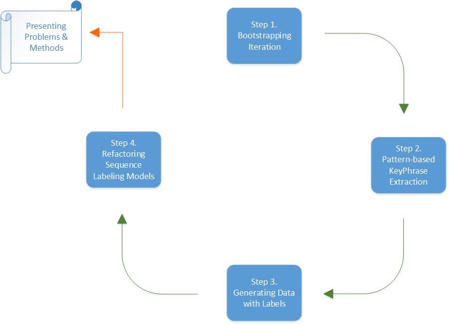

# Introduction
This repository published the source code of paper Presenting Problems and Methods under Weak Supervision. In this paper, we put forward a framework that can present the problem and the method of a given paper automatically by means of sequence labeling. The framework consists of four steps and three algorithms. Extensive experiments on three public datasets which are [AMiner](https://www.aminer.org), Microsoft Academic Graph ([MAG](https://www.microsoft.com/en-us/research/project/microsoft-academic-graph)) and Paper with Code ([PWC](https://github.com/zziz/pwc)) show the effectiveness of our framework. Details are provided in the code.

# Framework
We separate our framework into four parts, let we put them together. The figure below presents the flowchart of the framework we put forward. At first, we develop [Algorithm 1](framework/bootstrap.py) to find new pattern words in step 1 from massive text corpus in the settings of weak supervision. Step 2 involves in pattern-based phrase extraction implemented by [Algorithm 2](framework/extract.py). Then we generate data with labels in step 3 according to the overall pattern words and phrases
returned by previous two steps, and this step corresponds to [Algorithm 3](framework/generate.py). At last, it turns to step 4, various classical sequence labeling models are trained on labeled data to summarize or present the problem and the method with a prediction sequence of tags.  

# Contact
Anyone who is confronted with problems can open issues under this project. I am looking forward to hearing your voices and will reply you in time.
